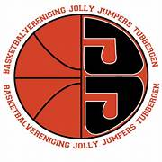

<html lang="nl">
<head>
  <meta charset="UTF-8">
  <meta name="viewport" content="width=device-width, initial-scale=1.0">
  <title>Jolly Jumpers Basketbal</title>
  
</head>
<body>

  <h1>Jolly Jumpers Basketbal</h1>

  

    
Welkom op mijn HTML-pagina over mijn basketbalteam: <strong>Jolly Jumpers</strong> uit Tubbergen!

    
Ik speel in het <strong>U14-1 Jongens</strong> team. Wij trainen elke week twee keer:

    <ul>
      <li><strong>Woensdag:</strong> 1 uur training</li>
      <li><strong>Vrijdag:</strong> 1 uur en 30 minuten training</li>
    </ul>
    
We hebben meestal wedstrijden op zaterdag, maar soms spelen we ook op vrijdagavond. De tijden kunnen verschillen, bijvoorbeeld om 11:30 of 14:00.

  

  

    <h2>Over Jolly Jumpers</h2>
    
Basketbalvereniging Jolly Jumpers is opgericht in <strong>1969</strong> en komt uit <strong>Tubbergen</strong>.

    
De club is vooral bekend vanwege het <strong>Dames 1 team</strong>, dat op het hoogste niveau speelt in de Nederlandse Eredivisie. De club heeft een sterke jeugdopleiding en teams voor jongens en meisjes in verschillende leeftijdscategorieën.

    
De club staat bekend om haar goede sfeer, sterke teamgeest, en enthousiaste vrijwilligers. Elk jaar worden er ook toernooien, kampen en andere leuke activiteiten georganiseerd.

  

  

    <h2>Teamlogo</h2>
    
  

  

    <h2>Misc</h2>
    <video width="640" height="360" controls autoplay loop muted poster="thumbnail.jpg">
      <source src="Windmill 360.mp4" type="video/mp4">
      Je browser ondersteunt de video tag niet.
    </video>
  

  

    <h2>Meer informatie</h2>
    

      <a href="https://jollyjumpersbasketbal.nl/aanmelden/" target="_blank">Aanmelden bij Jolly Jumpers</a> 
      <a href="https://jollyjumpersbasketbal.nl/u14-1-jongens" target="_blank">Mijn team: U14-1 Jongens</a> 
      <a href="https://jollyjumpersbasketbal.nl/" target="_blank">Officiële website van de club</a>
    

  

</body>
</html>
